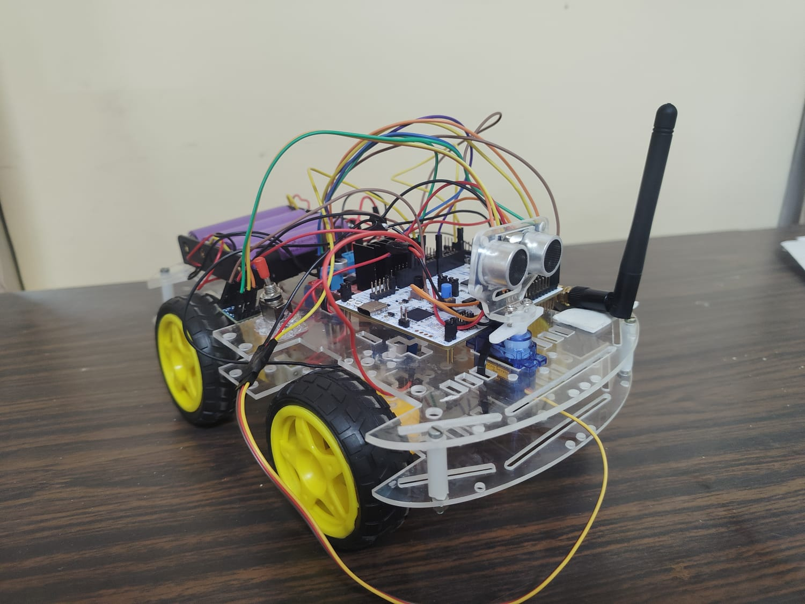
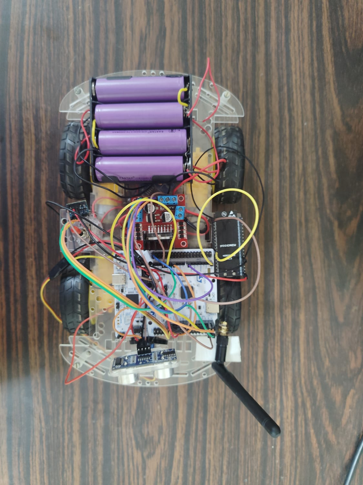
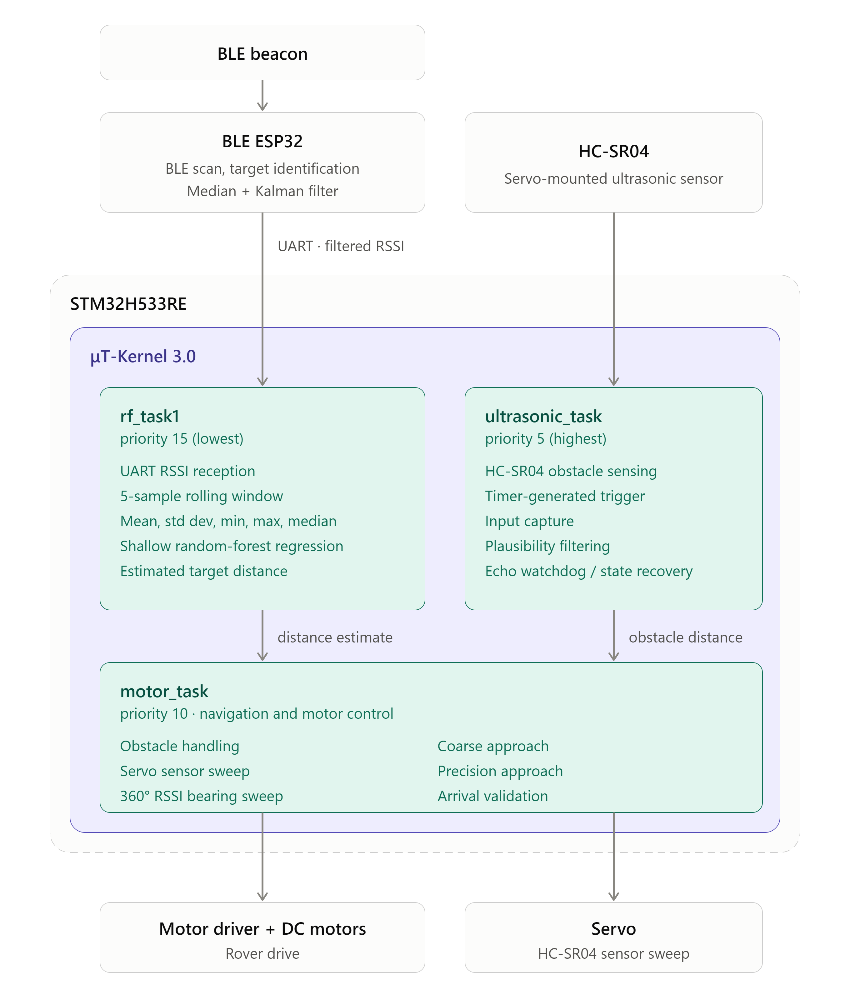

# Beacon-Tracking Rescue Rover

<!-- Badges: replace with real ones once CI/license are set up -->


<!--
IMAGE: Hero shot of the assembled rover
Suggested: a clear, well-lit photo of the full rover from a 3/4 angle,
showing the chassis, sensors, and antenna. This is the first thing
anyone visiting the repo sees.
-->



An autonomous rover that locates a person carrying a BLE beacon by RSSI
signal strength, navigates toward them while avoiding obstacles, and
stops on arrival. Built for a demo/competition event in Japan.

---

## Table of Contents

- [Overview](#overview)
- [Architecture](#architecture)
- [Hardware](#hardware)
- [Pin Configuration](#pin-configuration)
- [Software Architecture](#software-architecture)
- [Wiring Diagram](#wiring-diagram)
- [Demo](#demo)
- [Getting Started](#getting-started)
- [Current Status](#current-status)
- [Known Issues](#known-issues)
- [Roadmap](#roadmap)
- [Team](#team)

---

## Overview

This project is a two-microcontroller rescue rover:

- An **ESP32** scans for a BLE beacon (`RESCUE_BEACON`) via NimBLE, filters the received signal strength (median + Kalman filtering), and forwards a single filtered RSSI byte to the STM32 over UART.
- An **STM32H533RE** (Nucleo-64), running the μT-Kernel 3.0 RTOS, handles everything real-time: distance prediction from RSSI, ultrasonic obstacle sensing, and motor/servo control.

<!--
IMAGE: System overview diagram
Suggested: a simple block diagram showing ESP32 -> UART -> STM32 -> Motors,
with the BLE beacon and obstacle sensor as inputs. Can replace the
Mermaid diagram below if you'd rather use a hand-drawn/Figma version.
-->

---
## BLE Beacon Setup
Install nRF Connect for Mobile and configure the phone as a BLE advertiser with the local name 'MY_PHONE_BEACON' and the 128-bit Service UUID '4f2913e2-3489-4b68-b769-95213600f6ee'. Enable Scannable mode. The rover identifies the target beacon using this Service UUID.

## Architecture


Two-MCU design, communicating over UART:

| Component | Role |
|---|---|
| ESP32 | BLE scanning (NimBLE), RSSI filtering (median + Kalman), forwards one byte per sample |
| STM32H533RE | Real-time decision making: distance prediction, obstacle avoidance, motor/servo control |

The STM32 side runs three RTOS tasks, prioritized so sensor-critical work is never starved:

| Task | Priority (`itskpri`, lower = higher) | Responsibility |
|---|---|---|
| `ultrasonic_task` | 5 (highest) | HC-SR04 obstacle sensing |
| `motor_task` | 10 | Drive/steering decision logic |
| `rf_task1` | 15 (lowest) | RSSI receive + distance prediction |

---

## Hardware

<!--
IMAGE: Component layout / labeled parts photo
Suggested: a top-down or exploded photo of the rover with each major
component labeled (STM32, ESP32, L298N, HC-SR04, servo, battery, BMS).
-->

| Component | Details |
|---|---|
| MCU (real-time) | STM32H533RE Nucleo-64 |
| MCU (BLE) | ESP32 |
| Motor driver | L298N |
| Motors | 4x DC gear motors (skid-steer, 2 per side) |
| Obstacle sensor | HC-SR04 ultrasonic, servo-mounted |
| Power | 4S 18650 Li-ion pack + BMS, regulated 5V buck converter for logic |

---

## Pin Configuration

| Signal | STM32 Pin | Peripheral |
|---|---|---|
| Motor IN1 | PC0 | GPIO out |
| Motor IN2 | PC1 | GPIO out |
| Motor IN3 | PC2 | GPIO out |
| Motor IN4 | PC3 | GPIO out |
| Left PWM (ENA) | PA8 | TIM1_CH1 |
| Right PWM (ENB) | PA9 | TIM1_CH2 |
| Ultrasonic ECHO | PA6 | TIM3_CH1 (input capture) |
| Ultrasonic TRIG | PA7 | TIM3_CH2 (PWM) |
| Servo | PA5 | TIM2_CH1 |
| ESP32 UART RX | PB15 | USART1 |
| ESP32 UART TX | PB14 | USART1 |

> **Note:** PA2/PA3 are reserved by the ST-Link virtual COM port on this board — don't reuse them for the ESP32 link.

<!--
IMAGE: Pinout diagram
Suggested: the CubeMX pinout view or a hand-annotated board photo
showing exactly which physical pin each connection uses.
-->

---

## Software Architecture

### `rf_task.c`
Receives RSSI over USART1, builds a 5-sample feature vector (mean, std, min, max, median), and predicts distance using a small trained regression model. At very strong or very weak RSSI, an anchor override takes over rather than trusting the model's ambiguous mid-range output.

### `ultrasonic_task.c`
Drives the HC-SR04 (TRIG/ECHO on TIM3), with pulse-width plausibility filtering to reject implausible readings and a watchdog to recover from missed echoes.

### `servo_task.c`
Sweeps the ultrasonic sensor across a set of angles to find the clearest heading when an obstacle is detected.

### `motor_task.c`
Skid-steer drive control. Priority order each loop:
1. Ultrasonic obstacle check — always evaluated first, overrides everything else.
2. If the path is clear: approach the beacon using RSSI-predicted distance, slowing proportionally as it nears the arrival threshold, with a full 360° rotational sweep used periodically to re-find the beacon's heading (since the antenna itself can't determine direction on its own).

### `app_main.c`
Creates and starts the three tasks above.

<!--
IMAGE: Software/task flow diagram
Suggested: a flowchart of motor_task's decision priority (ultrasonic
check -> obstacle handling -> RSSI approach -> arrival), to complement
the text description above.
-->

---

<!--## Wiring Diagram

<!--
IMAGE: Full wiring/schematic diagram
Suggested: a Fritzing or hand-drawn schematic showing STM32 <-> L298N
<-> motors <-> battery/BMS <-> buck converter, and STM32 <-> ESP32
<-> HC-SR04/servo connections all in one diagram.
-->
<!--


---

## Demo

<!--
IMAGE/VIDEO: Rover in action
Suggested: a short GIF or embedded video link showing the rover
tracking the beacon and avoiding an obstacle during a test run.
-->
<!--

-->
---

## Getting Started

### Prerequisites
- STM32CubeIDE
- mtk3bsp2 (μT-Kernel 3.0 BSP for STM32H5)
- Arduino IDE or PlatformIO (for the ESP32 firmware)

### Building the STM32 firmware
```bash
# Open the project in STM32CubeIDE and build normally,
# or from the command line:
make -j all
```

### Flashing the ESP32 firmware
```bash
# Using Arduino IDE: select the correct ESP32 board, then Upload
# Or with PlatformIO:
pio run --target upload
```

---

## Current Status

- ✅ RSSI pipeline (ESP32 → STM32 UART → filtering → distance prediction): working
- ✅ Ultrasonic obstacle detection: false-positive crosstalk fixed, motors slow/stop correctly on approach
- ✅ Bearing/direction-finding via chassis rotation: implemented, still being tuned
- 🚧 RSSI anchor-override thresholds: need retuning against real field data
- 🚧 Motor channel (IN3/IN4) hardware issue: under investigation
- ⏳ Japan shipping/power logistics: undecided (DG-declared courier vs. local sourcing vs. NiMH substitution)

---

## Known Issues

- RSSI anchor-override thresholds are placeholder values and need to be retuned against real RSSI-vs-distance measurements for the actual hardware/environment.
- One motor channel (IN3/IN4 side) is currently non-functional — see open issue for diagnosis steps.
- ESP32 may require Giteki (技適) certification for RF use in Japan.

---

## Roadmap

- [ ] Retune RSSI anchor thresholds from field data
- [ ] Resolve IN3/IN4 motor channel fault
- [ ] Finalize battery/shipping approach for Japan
- [ ] Confirm Giteki certification requirements

---

## Team

<!--
IMAGE: Team photo
Suggested: a photo of the team, or individual headshots with names/roles.
-->

| Name | Role |
|---|---|
| Tarun Kumar M | Firmware (STM32, RTOS) , Hardware|
| Jai Suriyan V | Hardware, AI/ML integration, ESP32 programming |

For the detailed system design and operational logic, see
[ARCHITECTURE.md](./ARCHITECTURE.md).


